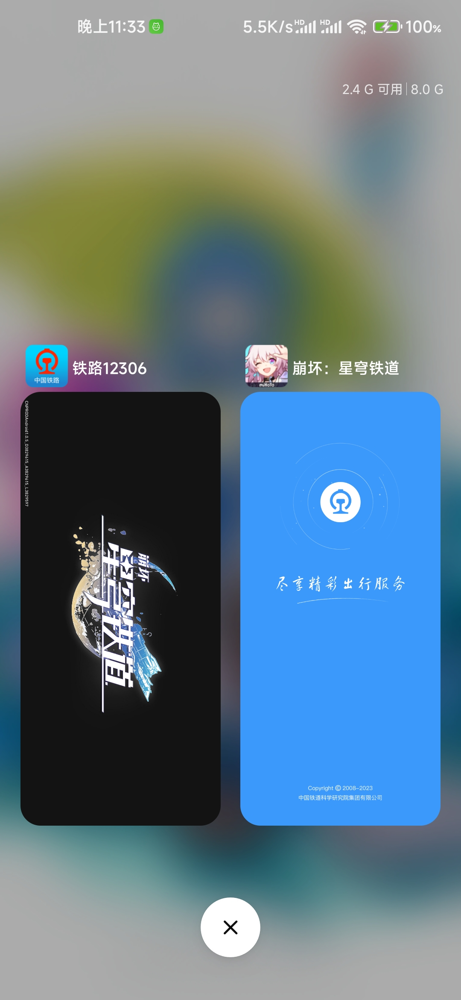
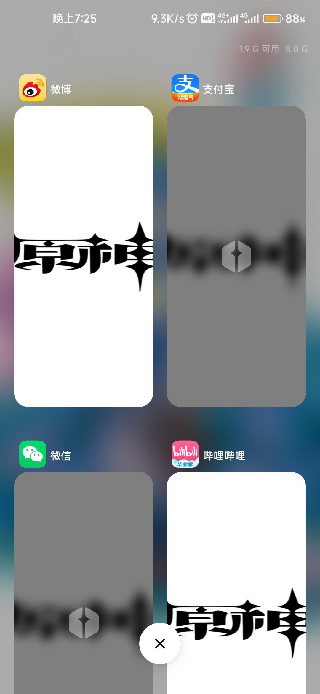

# ~~原神，启动~~
这是一个可以让你手机上星穹铁道和12306互换图标的xp模块 

# 作用域
**如果你是小米MIUI系统**直接按默认的作用域勾选就行 
**如果你是原生安卓或不是MIUI系统**勾选`系统桌面`、`系统设置`以及你想要替换的其他地方~~比如创建快捷方式~~

  

# 2.0更新: 全员原神启动
作用域需多选择一个`系统界面(com.android.systemui)`

